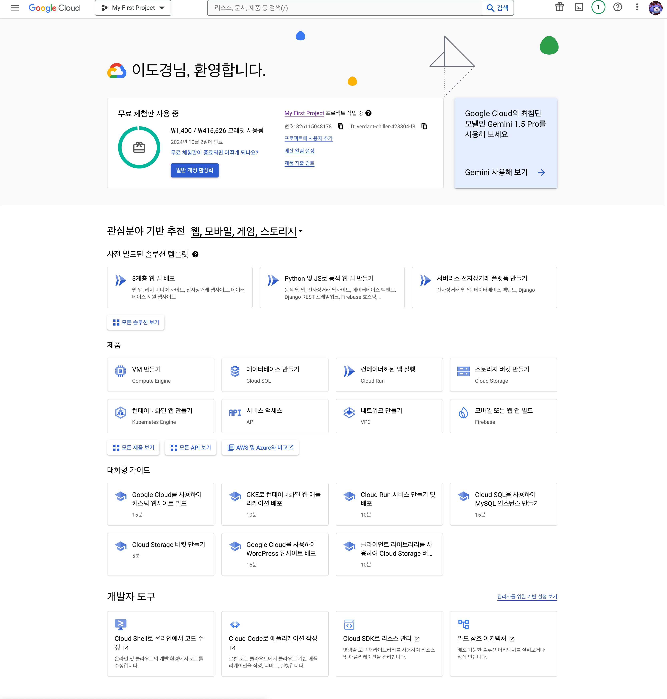
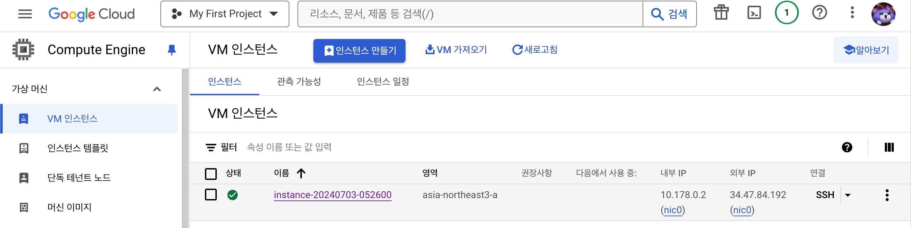
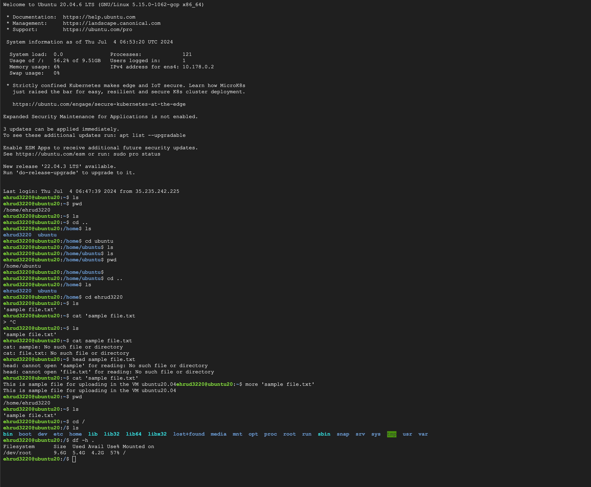
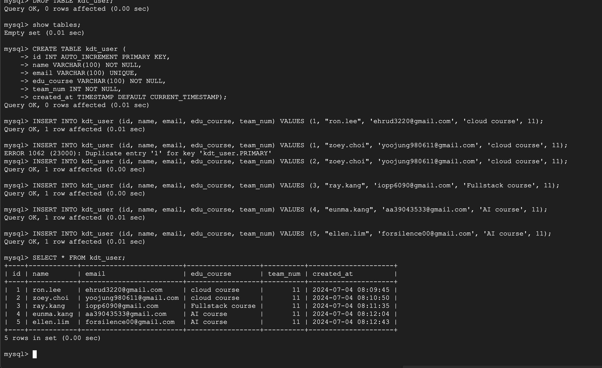
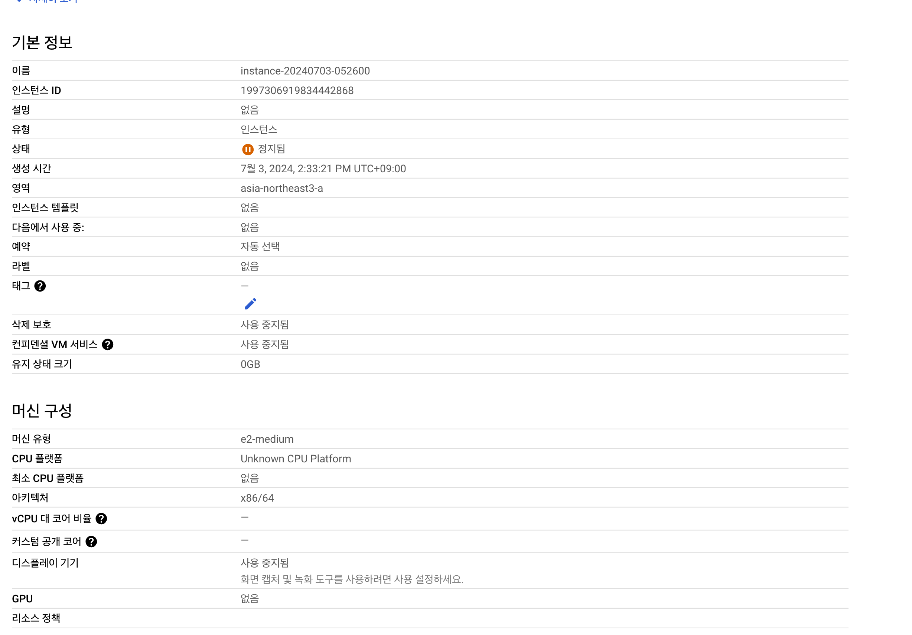
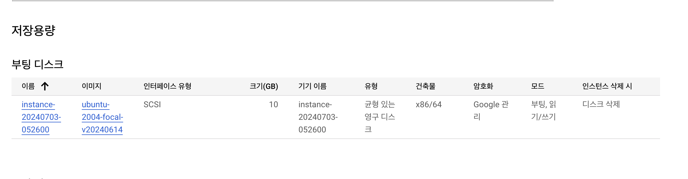
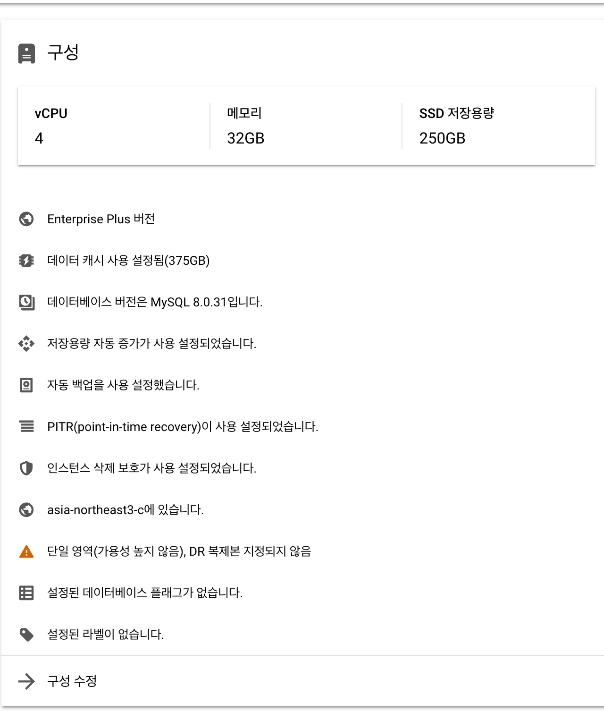

# 클라우드 서비스이 기본 개념 실습

1. AWS, Google Cloud, Azure 중 하나를 선택하여 계정을 생성합니다.
저는 Google Cloud를 선택해서 계정을 생성하였습니다.

2. 선택한 클라우드 서비스 제공자에서 가상 머신(VM)을 생성하고 설정합니다.

3. VM에 SSH를 사용하여 접속하고, 기본적인 명령어를 실행해봅니다.  & 스토리지 서비스를 설정하고, 샘플 파일을 업로드합니다.

4. 클라우드 데이터베이스 서비스를 설정하고, 간단한 테이블을 생성합니다.
MySQL을 설치 진행후에 저희 팀원을 테이블 kdt_user 생성한 후 테이블에 데이터 삽입 후 SELECT로 조회한 사진 

5. 설정한 VM, 스토리지, 데이터베이스의 스크린샷을 캡처합니다.
Ubuntu 20.04 VM

스토리지

데이터베이스 구성

